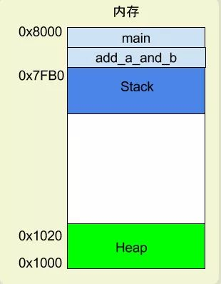

# \[1\]汇编语言概念，寄存器，内存模型

* 汇编语言概念
* 寄存器
* 内存模型

## 为什么叫汇编语言

因为把文字指令翻译成二进制指令的过程叫做汇编assembling，他处理的文本就是assembly code

标准化以后就叫做assembly language 缩写为asm，中文译为汇编语言

## 本质：

二进制指令的文本形式（与二进制指令是一一对应的关系）

计算机本质上运行的都是二进制指令

加法指令00000011写成汇编语言就是 ADD。只要还原成二进制，汇编语言就可以被 CPU 直接执行，所以它是最底层的低级语言。

> 学习汇编语言必须了解 寄存器 与 内存模型

## 寄存器

**寄存器的作用：**

cpu只负责运算，内存负责储存数据，CPU 要用的时候就去内存读写数据

矛盾：CPU 的运算速度远高于内存的读写速度

解决：为了避免被拖慢，CPU 都自带一级缓存和二级缓存

但是：CPU 缓存还是不够快，另外数据在缓存里面的地址是不固定的，CPU 每次读写都要寻址也会拖慢速度。因此，除了缓存之外，CPU 还自带了寄存器（register**）**

**作用：**储存最常用的数据。也就是说，那些最频繁读写的数据（比如循环变量）。CPU优先读写寄存器，再有寄存器跟内存交换数据

**四层内存模型：**

* CPU registers
* cache
* RAM
* Hard disk

**寄存器的名称辨识**：寄存器不依靠地址区分数据，而依靠名称。每一个寄存器都有自己的名称

**32位 CPU、64位 CPU** ：指的就是寄存器大小，32 位 CPU 的寄存器大小就是4个字节。

早期x86 CPU只有8个寄存器，现在寄存器已经有100多个了

## 内存模型

作用：内存只存放少量数据，大部分时候CPU要指挥寄存器，直接跟内存交换数据

**程序运行的时候操作系统会分配一段内存**：

用来储存程序和运行产生的数据。这段内存有起始地址和结束地址，比如从0x1000到0x8000，

**Heap:**

因为**用户主动请求而划分出来**的内存区域，叫做 Heap（堆）。\(例如malloc\)

它由起始地址开始，从低位（地址）向高位（地址）增长。

特点：

* 不会自动消失，必须手动释放
* 或者由垃圾回收机制来回收。

**Stack:**

由于**函数运行而临时占用**的内存区域。

从main\(\)开始执行时，会为它在内存里面建立一个帧（frame），所有main的内部变量都保存在这个帧里面。main函数执行结束后，该帧就会被回收，释放所有的内部变量，不再占用空间。

