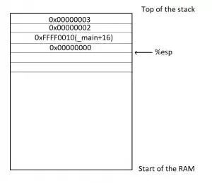

# \[2\] C程序与汇编语言对应代码

参考：[https://zhuanlan.zhihu.com/p/54890424](https://zhuanlan.zhihu.com/p/54890424)

了解寄存器和内存模型以后，就可以来看汇编语言到底是什么了。下面是一个简单的程序example.c。

```cpp
int add_a_and_b(int a, int b) {
   return a + b;
}
int main() {
   return add_a_and_b(2, 3);
}
```

gcc 将这个程序转成汇编语言。

```bash
$ gcc -S example.c
```

example.s经过简化以后，大概是下面的样子。

```text
_add_a_and_b:
   push   %ebx
   mov    %eax, [%esp+8] 
   mov    %ebx, [%esp+12]
   add    %eax, %ebx 
   pop    %ebx 
   ret  

_main:
   push   3
   push   2
   call   _add_a_and_b 
   add    %esp, 8
   ret
```

解读：push %ebx： push是 CPU 指令，%ebx是该指令要用到的运算子。一个 CPU 指令可以有零个到多个运算子。

## esp寄存器

**特定用途：保存当前 Stack 的地址**

从\_main标签开始执行，这时会在 Stack 上为main建立一个帧，并将 Stack 所指向的地址，写入 ESP 寄存器。

## push指令

```text
push   3
```

push指令用于将运算子放入 Stack，这里就是将3写入main这个帧。

**更新esp寄存器地址：**push指令其实有一个前置操作。它会先取出 ESP 寄存器里面的地址，将其减去4个字节，然后将新地址写入 ESP 寄存器。**使用减法是因为 Stack 从高位向低位发展**，4个字节则是因为3的类型是int，占用4个字节。

## call 指令

call指令用来调用函数。

```text
call   _add_a_and_b
```

上面的代码表示调用add\_a\_and\_b函数。这时，程序就会去找\_add\_a\_and\_b标签，并为该函数建立一个新的帧。

```text
push   %ebx
```

将 EBX 寄存器里面的值，写入\_add\_a\_and\_b这个帧，放入栈里



## mov 指令

mov指令用于**将一个值写入某个寄存器。**

```text
mov    %eax, [%esp+8]
```

这一行代码表示，先将 ESP 寄存器里面的地址加上8个字节，得到一个新的地址，然后按照这个地址在 Stack 取出数据。根据前面的步骤，可以推算出这里取出的是2，再将2写入 EAX 寄存器。

下一行代码也是干同样的事情。

```text
mov    %ebx, [%esp+12]
```

上面的代码将 ESP 寄存器的值加12个字节，再按照这个地址在 Stack 取出数据，这次取出的是3，将其写入 EBX 寄存器。

## add 指令

add指令用于**将两个运算子相加，并将结果写入第一个运算子。**

```text
add    %eax, %ebx
```

上面的代码将 EAX 寄存器的值（即2）加上 EBX 寄存器的值（即3），得到结果5，再将这个结果写入第一个运算子 EAX 寄存器（寄存器%eax就是存储结果的地方）。

## pop 指令

pop指令用于**取出 Stack 最近一个写入的值（即最低位地址的值）**，并将这个值**写入运算子指定的位置**。

```text
pop    %ebx
```

上面的代码表示，取出 Stack 最近写入的值（因为要回收栈了），再将这个值写回 EBX 寄存器（因为加法已经做完了，EBX 寄存器用不到了）。

**pop指令还会将 ESP 寄存器里面的地址加4，即回收4个字节。**

## ret 指令

ret指令用于终止当前函数的执行，将运行权交还给上层函数。也就是，当前函数的帧将被回收。

```text
ret
```

可以看到，该指令没有运算子。

随着add\_a\_and\_b函数终止执行，系统就回到刚才main函数中断的地方，继续往下执行。

```text
add    %esp, 8
```

上面的代码表示，**将 ESP 寄存器里面的地址，手动加上8个字节，再写回 ESP 寄存器**。这是因为 ESP 寄存器的是 Stack 的写入开始地址，前面的pop操作已经回收了4个字节，这里**再回收8个字节**，等于全部回收。

