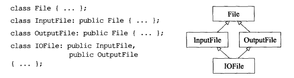

# Effective C++（浓缩部分）

* 《Effective C++》

[https://github.com/huihut/interview\#effective](https://github.com/huihut/interview#effective)

### 02. 尽量以 const、enum、inline 替换 \#define

**也就是尽量 以编译器 替换 预处理器**

* **常量的话：用const, enum**
* **函数的话：用inline**

\#define经常会有一些误用， 因为define未必会被编译器看到，在预编译期间就被预处理器替换走了

这时候如果有一些错误，编译器是无法再调试期间发现的

例如：本身想使用这个函数宏来代替函数调用，为了减少开销

```cpp
#define CALL_WITH_MAX(a, b) f((a) > (b) ? (a) : (b))
```

但是会出现一些不可思议的事

```cpp
int a = 5, b = 0;
CALL_WITH_MAX(++a, b);    //a会被累加2次
CALL_WITH_MAX(++a, b+10); //a会被累加1次
```

就会导致函数的行为未定义

**解决办法：**

```cpp
template <typename T>
inline void callWithMax(const T& a, const T& b){
    f(a > b ? a : b);
}
```

### 03. 尽可能使用const

作用：告诉**编译器**和**其他程序员** 该值保持不变

**const实施于成员函数**目的：

* 为了确认该成员函数可作用于const对象的身上
* 另外，当const和non-const成员有着实质等价的实现时，令non-const版本的实现去调用const版本，可以尽量减少代码的重复，少写一份函数代码（这个很重要）

### 04. 确定对象被使用前已经先被初始化

### 06.若不想使用编译器自动生成的函数，就该明确拒绝

面向对象建造类的过程中，**编译器会自动生成 默认构造函数，拷贝构造函数，拷贝赋值运算符，析构函数等**... 

但是有时候是需要禁止拷贝的，例如单例对象，这时候需要禁止掉编译器这些函数

**方法1：在声明中使用delete即可**

```cpp
Uncopyable (const Uncopyable&) = delete;
Uncopyable& operator = (const Uncopyable&) = delete;
```

**方法2：在类中声明为private函数**

然后使用另一个类private继承这个类，只去使用另一个类

```cpp
class Uncopyable{
   ...
private:
    Uncopyable (const Uncopyable&);
    Uncopyable& operator = (const Uncopyable&);
}

class HomeForSale : private Uncopyable{
   ...
}
```

### 08. 别让异常逃离析构函数

析构函数应该**吞下不传播异常**，**或者结束程序**，而不是吐出异常；（C++不禁止但不鼓励）

**关键！！**如果某个操作可能在失败时抛出异常，又要求**必须处理该异常**，那么这个**异常必须来自于析构函数以外的某个函数**，不能是析构函数处理异常

**主要原因：在析构函数抛出异常时，允许它离开这个析构函数，这时候就会造成问题**

**解决办法：使用abort（调用异常，最好是先终止，记录下失败）**

```cpp
DBConn::~DBConn(){
    try {db.close();}
    catch (...){
        //制作运转记录，记下对close的失败
        std::abort();
    }
}
```

### 09. 绝不在构造函数或者析构函数中调用virtual函数

原因：因为这类调用从不下降至derived class，也就是不会有多态的行为

### 10.编写operator=的时候，注意事项

**①要注意，返回reference给自己\(\*this\)**

**②要注意，处理“自己给自己赋值”的特殊情况，自我赋值安全**

**解决样例：**

```cpp
Widget & Widget::operator=(const Widget& rhs){
    if(this == &rhs)return *this; //11
    delete pb;
    pb = new Bitmap(*rhs.pb);
    return *this; //10
}
```

### 13. RAII思想：资源取得时机便是初始化时机

这一点主要是在std::lock\_guard上体现了这点

* 拿到锁的时候就是初始化管理对象的时候
* 析构的时候就是释放锁的时候

### 14. RAII对象可能要 禁止复制 or 对底层资源采用“引用计数法”

* **禁止复制**：因为管理的资源是唯一的，例如锁，可以通过禁止复制的方法来管理
  * 这时候需要采用条款6的方法
* **对底层资源采用“引用计数法”**：有时候希望保有资源，直到最后一个使用者被销毁的时候才释放
  * 通过shared\_ptr来实现

### 16.使用相同行为的new和delete

错误示例：创建的是数组，但是只删除了一个对象（需要注意，**易错**）

```cpp
std::string* stringArray = new std::string[100]; 
...
delete stringArray;
```

正确示例：\(数组与数组对应）

```cpp
std::string* stringPtr1 = new std::string; //对应的应该是对象删除
std::string* stringPtr2 = new std::string[100]; //对应的应该是对象数组地删除
...
delete stringPtr1;                         //删除对象
delete [] stringPtr2;                      //删除一个对象的数组
```

### 17.要使用独立语句将new对象置入智能指针

因为编译器的优化功能，可能导致指令重排

**错误示例：**

```cpp
//调用函数时，进行智能指针的构造
processWidget(std::shared_ptr<Widget>(new Widget), priority());
```

编译器创建代码，要做一下三件事

* 调用priority\(\)
* 执行new Widget
* 调用std::shared\_ptr构造函数

C++编译器的执行次序弹性很大，不像Java与C\#都是以特定顺序执行这些操作

由于依赖关系执行new Widget一定是在调用std::shared\_ptr构造函数之前

但是priority随时都有可能，所以可能会导致**第一顺位执行new Widget，第二顺位执行priority\(\)，第三顺位调用std::shared\_ptr构造函数**

问题在于如果调用priority\(）触发异常，程序中止，那么返回new Widget的指针将会遗失，所以也就造成了**内存泄漏**

**正确做法**

```cpp
std::shared_ptr<Widget>pw(new Widget);
processWidget(pw, priority);
```

### 20. 传引用替代传值

* **效率很高，减少拷贝构造开销**
* **可以避免切割问题**

### **21.该返回对象的时候，就不要返回reference**

不要以为返回reference可以提升性能

**糟糕的示例1：**

```cpp
const Rational& operator* (const Rational& lhs, const Rational& rhs){
    Rational result(lhs.n * rhs.n, lhs.d * rhs.d);
    return result;
}
```

**依然要付出一个构造函数的代价**

**返回一个reference指向一个local对象**，在函数退出销毁时，返回的引用指向的一个被销毁的对象，就是一个未被定义的行为

**糟糕的示例2：**

```cpp
const Rational& operator* (const Rational& lhs, const Rational& rhs){
    Rational* result = new Rational(lhs.n * rhs.n, lhs.d * rhs.d);
    return *result;
}
```

**依然要付出一个构造函数的代价**

**存在的问题：就是谁该对这个被new出来的对象delete，如果将来没有人去delete，就内存泄漏了**

### **23. 尽量用non-member非成员函数替换成员函数，从而保证封装性**

### **26.尽量延后变量定义的时间**

**“尽快延后的”真正意义：尝试延后这个定义，直到能给它初始实参为止**

**示例：vector的定义，先预留，尽量不要用resize或者其他初始化的方法**

```cpp
vector<int>a;
a.reverse(100);
...
//使用
```

下面两种构造模式，尽量采用方法A，而不是方法B（赋值成本比构造+析构要低）

```cpp
//方法A: 1个构造函数 + 1个析构函数 + n个赋值操作
Widget w;
for(int i = 0; i < n; ++i){
    w = f(i);
}
//方法B：n个构造函数 + n个析构函数
for(int i = 0; i < n; ++i){
    Widget w(f(i));
}
```

### 27.尽量少做转型动作

**转型动作：**

旧式：`(T)expression`、`T(expression)`；新式：`const_cast<T>(expression)`、`dynamic_cast<T>(expression)`、`reinterpret_cast<T>(expression)`、`static_cast<T>(expression)`；

* 尽量避免转型、注重效率避免 dynamic\_casts、尽量设计成无需转型
* 如果某个转型是必要的，试着将它隐藏在某个函数背后（把转型封装成函数），客户随时可以调用这个函数，而无需将转型放进他们自己的代码中
* 宁可用C++Style新式转型，不要使用旧式转型（因为新式转型有分类，比较容易知道这个是在干嘛）

### 28.尽量不要令public成员函数返回一个protected,private成员函数的指针（handle）

并不是一定不能返回，只是这样常常会导致客户可以修改内部成员，这往往是不希望发生的

### 29. 保证异常安全

不异常安全代码示例：


**异常安全**是指

* 不泄漏任何资源
  * 上述代码，一旦new Image导致异常，unlock调用就不会执行了，永远锁住了
* 不允许数据败坏
  * 上述new Image抛出异常的话，本质上没有创建新对象，但是imageChanges已经++了

保证异常安全的方式：有三种

**①基本保证**

**②强烈保证：**

**异常抛出保证程序状态不改变**

* 如果函数成功：就是完全成功
* 如果函数失败：程序会回复到之前的状态

**copy-and-swap策略：保证强烈异常**

**按照下面这种方式：①RAII的锁②share\_ptr.reset③++放在执行操作后**

```cpp
class PrettyMenu{
    ...
    std::shared_ptr<Image>bgImage;
    ...
}
void PrettyMenu::changeBackground(std::istream& imgSrc){
    lock ml(&mutex); //使用RAII的lock_guard来保证退出函数就会释放锁
    bgImage.reset(new Image(imgSrc)); //shared_ptr.reset函数只有在里面的new执行成功才会被调用
    ++imageChanges; //放在之后设置
}
```

**③不抛异常：**

承诺绝对不抛出异常

### 30. inline只是一个编译器申请，不是强制命令

**inline函数**一般必须**被置于头文件中**，因为大部分都是在编译过程中进行inlining

将函数调用，替换成函数代码

* 大部分编译器对于带有循环或者递归的函数，一般会拒绝inline
* 构造函数与析构函数，往往对于Inlining是比较糟糕的候选：因为有继承可能发生
* 如果有函数指针inlining也不太行

### 31. 将文件间的编译依存关系降至最低

假设对C++某个程序**某个class实现了轻微的修改**，修改的不是接口而是实现

然后**重建了这个程序，make**

**结果需要把整个程序重新编译和链接一下**，**过于麻烦**

**问题：C++并没有把“将接口从实现中分离”这事做的很好**

\*\*\*\*

**编译依存问题：**

如果**头文件中有任何一个被改变**，或这些头**文件所依赖的其他头文件有任何改变**，那么**每一个含有这个类文件就得重新编译**，任何使用这个类的文件也得重新编译，这样**连串编译依存关系**，就是编译依存的问题


**将编译依存最小化的方法：**

“接口与实现分离”，关键在于以**“声明的依存性“**替换**“定义的依存性”**

让头文件尽可能自我满足，万一做不到则让它与其他文件的**声明式相依**


* 程序库头文件应该以**“完全且仅有声明式“**的形式存在

### 32. public继承意味着is-a关系

Student is a Person:

```cpp
class Person{ ... };
class Student: public Person{ ... };
```

classes之间的**三种关系**：

* is-a 是一个
* has-a 有一个
* is-implemented-in-terms-of 根据某物实现出

### 34. 区分接口继承 和 实现继承（实现3种继承行为）

public继承分为2种继承，其中包含3种期望的行为

* **函数接口继承**：①只继承成员函数的接口（也就是声明），必须要override自己的实现
* **函数实现继承**：
  * ②同时继承函数的接口和实现，有时候希望会**override**它们所继承的实现
  * ③同时继承函数的接口和实现，只允许遵循原本的实现，不允许override任何东西

**行为①：**有时候只希望derived class继承函数接口，但是让derived class他们自己去实现

**声明一个纯虚函数pure virtual的目的就是为了让derived classes只继承函数接口**

```cpp
class Shape{
public:
    virtual void draw() const = 0;
    ...
};
```

**行为②：声明一个非纯虚函数impure virtual**

```cpp
class Shape{
public:
    virtual void error(const std::string& msg);
    ...
};
```

**行为③：声明一个非虚函数non-virtual**

```cpp
class Shape{
public:
    int ObjectID() const;
    ...
}
```

### 35.虚函数/非虚函数接口实现 模板方法模式与策略模式


### 36.绝不重新定义 继承而来的non-virtual函数

### 37.绝不重新定义 继承而来的缺省参数值

缺省参数值：

```cpp
原本类中的函数：
virtual void draw(ShapeColor color) const = 0;
继承函数时重新定义了参数缺省值（不允许）：
virtual void draw(ShapeColor color = Blue) const;
```

### 38.复合意味着“has-a”关系 或 “is-implemented-in-terms-of 根据某物实现出”关系

**复合composition**


* 在应用域，意味着“has-a”关系
  * 例如人，汽车，一张张视频画面
* 在实现域，意味着“is-implemented-in-terms-of 根据某物实现出”关系
  * 例如缓冲区的实现，互斥锁，查找树等的实现

### 39.谨慎的使用private继承

private继承并不意味着"is-a"关系

**private继承特性：**

如果classes的继承关系是private

* **编译器不会自动将一个derived class对象转换为一个base class对象**
* **由private base class继承而来的所有成员，在derived class中都会变成private属性**

### 40.谨慎的使用多重继承

多重继承比单一继承复杂，会涉及**虚继承**



**虚继承会增加大小，速度，初始化复杂度等各种成本**

* 所以**如果virtual base classes不带有任何数据**，那么**就不会触发虚继承，实现效率就比较高**

**所以建议多重继承interface classes（也就是虚类）**


### **41.classes面向对象编程是运行时动态，templates模板编程是编译器多态**


### **42.typename两个用途**

**用途1：与class互换template&lt;typename T&gt;**

用途2：声明在类型前用来验证**嵌套从属类型名称**


* 上述的C并不是嵌套从属类型名称，所以声明container时并不需要以typename为前导
* C::iterator是个嵌套从属类型，所以必须以typename作为前导

### 43-48.泛型编程相关

### 49. std::set\_new\_handler：如果new失败了，设置new的异常处理


### 51. 定制operator new/operator delete的规则


### 52.写了placement new也要写placement delete

**Placement new的含义**

placement new 是重载operator new 的一个标准、全局的版本，它不能够被自定义的版本代替（不像普通版本的operator new和operator delete能够被替换）。

void \*operator new\( size\_t, void \* p \) throw\(\) { return p; }

placement new的执行忽略了size\_t参数，只返还第二个参数。其结果是允许用户把一个对象放到一个特定的地方，达到调用构造函数的效果。和其他普通的new不同的是，它在括号里多了另外一个参数。比如：

Widget \* p = new Widget;                    //ordinary new

pi = new \(ptr\) int; pi = new \(ptr\) int;     //placement new

括号里的参数ptr是一个指针，它指向一个内存缓冲器，placement new将在这个缓冲器上分配一个对象。Placement new的返回值是这个被构造对象的地址\(比如括号中的传递参数\)。placement new主要适用于：在对时间要求非常高的应用程序中，因为这些程序分配的时间是确定的；长时间运行而不被打断的程序；以及执行一个垃圾收集器 \(garbage collector\)。

**new 、operator new 和 placement new 区别**

（1）new ：不能被重载，其行为总是一致的。它先调用operator new分配内存，然后调用构造函数初始化那段内存。

new 操作符的执行过程：  
1. 调用operator new分配内存 ；  
2. 调用构造函数生成类对象；  
3. 返回相应指针。

（2）operator new：要实现不同的内存分配行为，应该重载operator new，而不是new。

operator new就像operator + 一样，是可以重载的。如果类中没有重载operator new，那么调用的就是全局的::operator new来完成堆的分配。同理，operator new\[\]、operator delete、operator delete\[\]也是可以重载的。

（3）placement new：只是operator new重载的一个版本。它并不分配内存，只是返回指向已经分配好的某段内存的一个指针。因此不能删除它，但需要调用对象的析构函数。

如果你想在已经分配的内存中创建一个对象，使用new时行不通的。也就是说placement new允许你在一个已经分配好的内存中（栈或者堆中）构造一个新的对象。原型中void\* p实际上就是指向一个已经分配好的内存缓冲区的的首地址。

