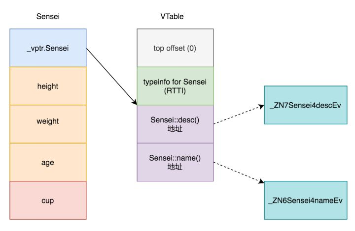
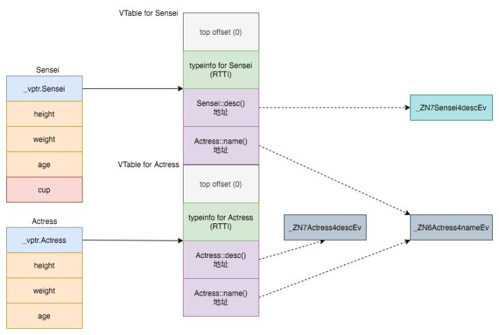

# 虚表 函数绑定

* C++相对于C哪里面向对象了
* C++面向对象的实质还是**面向过程的一种封装**，成员函数实质是**函数绑定**
* 静态绑定与动态绑定
* 虚表作用是什么
* 虚表是什么样子的，什么工作原理

> [https://www.zhihu.com/question/389546003/answer/1194780618](https://www.zhihu.com/question/389546003/answer/1194780618)

### C++相对于C哪里体现面向对象

**面向对象核心**是要起到 **将对象中的数据和操作封装到一起**的效果

C语言实现一个类似面向对象的类，应该怎么做呢？

方法1（面向对象风格的C）：在struct中添加函数指针， 想达到面向对象中**数据和操作封装到一起**的效果，只能给struct里面添加函数指针，然后给函数指针赋值。

```c
typedef struct Actress{
    int height;
    int weight;
    int age;
    
    void (*desc)(struct Actress*);
}Actress;

//本身应该作为面向对象的成员：输出信息的函数
void profile(Actress* obj){
    printf("height:%d weight:%d age:%d\n", obj->height, obj->weight, obj->age);
}

//调用的时候
Actress a;
...
a.desc = profile;
a.desc(&a);
```

**问题**是每个实例化的对象中都会有一个指针大小（比如8字节）的空间占用**（多开销）**

如果实例化N个对象，每个对象有M个成员函数，那么就要占用N\*M\*8的内存。

方法2（一般情况的C）：

```c
typedef struct Actress{
    int height;
    int weight;
    int age;
    
}Actress;

//本身应该作为面向对象的成员：输出信息的函数
void desc(Actress* obj){
    printf("height:%d weight:%d age:%d\n", obj->height, obj->weight, obj->age);
}

//调用的时候
Actress a;
...
desc(&a);
```

普通C++的类：

```cpp
class Actress{
public:
    int height;
    int weight;
    int age;
    
    void desc(){
        printf("height:%d weight:%d age:%d\n", height, weight, age);
    }
};

//调用的时候
Actress a;
...
a.desc();
```

注意：这个class实际上相对于上面写法2中的实现，C++编译器实际会帮你生成一个类似上例中C语言写法二的形式，**是C++ zero overhead指导方针的一个体现**

\*\*\*\*

### **C++面向对象的实质还是面向过程的一种封装**

C++中类和**操作的封装只是对于程序员而言的，**而**编译器编译之后其实还是面向过程**的代码

编译器帮你给成员函数增加一个额外的类指针参数，运行期间传入对象实际的指针

 **类的数据（成员变量）和操作（成员函数）其实还是分离的**。

所以**C++成员函数实质是函数绑定**

\*\*\*\*

### 静态绑定与动态绑定

**静态绑定：**在类不含有虚函数的情况下，**编译器在编译期间就会把函数的地址确定下来，**运行期间直接去调用这个地址的函数即可。这种函数调用方式也就是所谓的『静态绑定』（static binding）

**动态绑定：**

**虚函数**出现其实就是面向对象三大特性之一的多态（polymorphism）

```cpp
class Actress{
public:
    Actress(int h, int w, int a):height(h),weight(w),age(a){};
    virtual void desc(){
        printf("height:%d weight:%d age:%d\n", height, weight, age);
    }
    int height;
    int weight;
    int age;
};

class Sensei: public Actress{
public:
    Sensei(int h, int w, int a, string c):Actress(h,w,a),cup(c){};
    virtual void desc(){
        printf("height:%d weight:%d age:%d\n", height, weight, age);
    }
    string cup;
};

```

动态绑定示例：

```cpp
Sensei(168, 50, 20, "A");
//动态绑定必须指针或者引用
Actress* a = &s;
a->desc();
//输出：height:168 weight:50 age:20 cup:A
Actress& b = s;
b.desc();
//输出：height:168 weight:50 age:20 cup:A
```

 这个现象称之为『**动态绑定**』（dynamic binding），运行期间根据类型来确定调用的函数地址。

 **把父类Actress中desc函数前面的vitural去掉**，这个代码最终将调用父类的函数desc，而非子类的desc

输出：height:168 weight:50 age:20


### 虚表作用是什么

用于解决动态绑定方式时，虚函数调用函数的查找表（所以也叫虚函数表）

 **每个使用虚函数的类（或者从使用虚函数的类派生）都有自己的虚拟表**。


### 虚表是什么样子的，什么工作原理

虚表只是**编译器在编译时设置的静态数组**。虚拟表包含可由类的对象调用的每个虚函数的一个条目。此表中的每个条目只是一个函数指针，指向该类可访问的派生函数。

示例详解：

#### demo1:

```cpp
class Actress{
public:
    Actress(int h, int w, int a):height(h),weight(w),age(a){};
    virtual void desc(){
        printf("height:%d weight:%d age:%d\n", height, weight, age);
    }
    virtual void name(){
        printf("I am a actress");
    }
    int height;
    int weight;
    int age;
};

class Sensei: public Actress{
public:
    Sensei(int h, int w, int a, string c):Actress(h,w,a),cup(c){};
    virtual void desc(){
        printf("height:%d weight:%d age:%d\n", height, weight, age);
    }
    virtual void name(){
        printf("I am a sensei");
    }
    string cup;
};
```

clang输出对象的**内存布局**：

```cpp
$ clang -cc1 -fdump-record-layouts -stdlib=libc++ actress.cpp
```

```cpp
*** Dumping AST Record Layout
         0 | class Actress
         0 |   (Actress vtable pointer)
         8 |   int height
        12 |   int weight
        16 |   int age
           | [sizeof=24, dsize=20, align=8,
           |  nvsize=20, nvalign=8]

*** Dumping AST Record Layout
         0 | class Sensei
         0 |   class Actress (primary base)
         0 |     (Actress vtable pointer)
         8 |     int height
        12 |     int weight
        16 |     int age
        20 |   char [4] cup
           | [sizeof=24, dsize=24, align=8,
           |  nvsize=24, nvalign=8]
```

可以发现父类Actress的起始位置多了一个Actress vtable pointer。子类Sensei是在它的基础上多了自己的成员cup。

**vptr：**也就是说在**含有虚函数的类编译期间**，**编译器会自动给这种类在起始位置追加一个虚表指针**（称之为：vptr）。**vptr指向一个虚表**（称之为：vtable 或 vtbl），虚表中存储了实际的函数地址。

用clang或者g++打印一下虚表

g++输出的虚表结果（请在Linux上使用g++）

```text
$ g++ -fdump-class-hierarchy actress.cpp
```

```cpp
Vtable for Actress
Actress::_ZTV7Actress: 4u entries
0     (int (*)(...))0
8     (int (*)(...))(&amp; _ZTI7Actress)
16    (int (*)(...))Actress::desc
24    (int (*)(...))Actress::name

Class Actress
   size=24 align=8
   base size=20 base align=8
Actress (0x0x7f9b1fa8c960) 0
    vptr=((&amp; Actress::_ZTV7Actress) + 16u)

Vtable for Sensei
Sensei::_ZTV6Sensei: 4u entries
0     (int (*)(...))0
8     (int (*)(...))(&amp; _ZTI6Sensei)
16    (int (*)(...))Sensei::desc
24    (int (*)(...))Sensei::name

Class Sensei
   size=24 align=8
   base size=24 base align=8
Sensei (0x0x7f9b1fa81138) 0
    vptr=((&amp; Sensei::_ZTV6Sensei) + 16u)
  Actress (0x0x7f9b1fa8c9c0) 0
      primary-for Sensei (0x0x7f9b1fa81138)
```

所以，所有虚函数的的调用取的是哪个函数（地址）是在运行期间通过查虚表确定的。



**注意：vptr指向的并不是虚表的表头，而是直接指向的虚函数的位置。**

虚表本身是连续的内存。动态绑定的实现也就相当于（假设p为含有虚函数的对象指针）**：**

```text
(*(p->vptr)[n])(p)
```

但其实上面的图片也只是简化版，不是完整的的虚表。通过gdb查看，你其实可以发现子类和父类的虚表是连在一起的。

**demo2:**

再改一下代码。我们让子类Sensei只重载一个父类函数desc，不实现name函数。

变成这样的情况，name\(\)指向同一个函数实现




