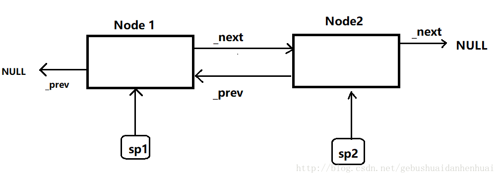

# 智能指针

### 原始指针可能导致的问题（主要3个）

* 没办法区分指针是**对象还是数组**
* 要销毁的时候，没办法决定**是用delete还是析构函数**
* 不知道该指针到底有没有所指之物，因为没有引用计数，所以没有办法告诉你指针是否变成了**悬空指针（dangling pointers）**，即内存中不再存在指针 所指之物。悬空指针会在对象销毁后仍然指向它们



* shared\_ptr 
* unique\_ptr
* weak\_ptr
* auto\_ptr（被 C++11 弃用）


### **shared\_ptr**

多个智能指针可以共享同一个对象，对象的最末一个拥有着有责任销毁对象，并清理与该对象相关的所有资源。\(类似于原本c指针的行为）

特性：

* 支持定制型删除器（custom deleter），可防范 Cross-DLL 问题（对象在动态链接库（DLL）中被 new 创建，却在另一个 DLL 内被 delete 销毁）、自动解除互斥锁
* **不是线程安全**

**shared\_ptr本质实现**


简化为两个部分：ptr与ref\_count的use\_count值

**`shared_ptr<Foo>x = new Foo();`**


**`shared_ptr<Foo>y = x;`**


**引用计数实现一些关键点，（**性能会稍微有所折扣）

* std::shared\_ptr ⼤小是原始指针的两倍，因为它内部包含⼀个指向资源的原始指针，还包含⼀ 个资源的引⽤计数值
* 存在一个很关键的实现问题：**引用计数动态分配的情况。** 理论上，**引⽤计数与所指对象关联起来，但是被指向的对象不知道这件事情**（译注：不知道有指向⾃⼰的指针）。因此它们**没有办法存放⼀个引⽤计数值**。不过使用 std::make\_shared 创建 std::shared\_ptr 可以避免引用计数的动态分配，但是还存在⼀些 std::make\_shared 不能使用的场景，这时候引用计数就会动态分配。
* **递增递减引用计数必须是原子性的**，因为多个reader、writer可能在不同的线程。⽐如，指向某种 资源的 std::shared\_ptr 可能在⼀个线程执⾏析构，在另⼀个不同的线程， std::shared\_ptr 指 向相同的对象，但是执⾏的确是拷⻉操作。原⼦操作通常⽐⾮原⼦操作要慢，所以即使是引⽤计 数，你也应该假定读写它们是存在开销的。

**std::shared\_ptr 使用delete作为资源的默认销毁器，但是 它也⽀持自定义的销毁器**。这种支持有别于 std::unique\_ptr 。对于 std::unique\_ptr 来说，销毁器 类型是智能指针类型的⼀部分。对于 std::shared\_ptr 则不是

std::shared\_ptr 为任意共享所有权的资源⼀种**自动垃圾回收的便捷⽅式**。 较之于 std::unique\_ptr ， std::shared\_ptr 对象通常大两倍，控制块会产生开销，需要原子引用计数修改操作。

**std::shared\_ptr的缺陷**

* 当你的资源由 std::shared\_ptr 管理，现在⼜想修改资源生命周期管理⽅式是没有办法的。 即使引⽤计数为⼀，你也不能重新修改资源所有权，改⽤ std::unique\_ptr 管理它。

  所有权和 std::shared\_ptr 指向的资源之前签订的协议是“**除非死亡否则永不分离**”。

* 避免从原始指针变量上创建 std::shared\_ptr，std::shared\_ptr 的**API设计之初就是针对单个对象的**，是不能处理数组这种指针的

### **weak\_ptr**

**最精确的描述：⼀个类似 std::shared\_ptr 但不影响对象引用计数的指针，不参与资源所有权共享**

**这种指针可能指向一个被销毁的对象，在悬空时知晓，悬空\(dangle\)就是指针指向的对象不再存在**

weak\_ptr 允许你共享但不拥有某对象，一旦最末一个拥有该对象的智能指针失去了所有权，任何 weak\_ptr 都会自动成空（empty）。因此，在 default 和 copy 构造函数之外，weak\_ptr 只提供 “接受一个 shared\_ptr” 的构造函数。

测试是否是悬空指针：检查 std::weak\_ptr 是否已经失效

```cpp
auto spw = std::make_shared<Widget>();
std::weak_ptr<Widget> wpw(spw);
spw = nullptr;

if(wpw.expired()) ...
```

一个原子操作**实现检查是否过期，如果没有过期就访问所指对象**。  
这可以通过从 std::weak\_ptr 创建 std::shared\_ptr 来实现

```cpp
std::shared_ptr<Widget> spw1 = wpw.lock(); // if wpw's expired, spw1 is null 
auto spw2 = wpw.lock(); // same as above, but uses auto
```

**std::weak\_ptr实现**

从效率⻆度来看， std::weak\_ptr 与 std::shared\_ptr 基本相同。两者的⼤小是相同的

构造、析构、赋值操作涉及引⽤计数的原⼦操作。std::weak\_ptr 不影响引⽤计数。只是 std::weak\_ptr 不参与对象的共享所有 权，因此不影响指向对象的引⽤计数。实际上在控制块中还是有第⼆个引用计数， std::weak\_ptr 操作的是第⼆个引用计数。

**应用：**

* 用于判断悬空指针
* 潜在使用场景包括：caching、observer lists
* 打破 std::shared\_ptr 指向循环，可打破环状引用（cycles of references，两个其实已经没有被使用的对象彼此互指，使之看似还在 “被使用” 的状态）的问题

**循环引用**

但是我们说了，shared\_ptr存在循环引用的问题。我们先介绍一下什么是shared\_ptr的循环引用。

我们知道，智能指针shared\_ptr采用的是引用计数的方式，下面我们来写一个双向链表。

```cpp
struct Node
{
    int _value;
    shared_ptr<Node> _next;
    shared_ptr<Node> _prev;
};

int main()
{
    shared_ptr<Node> sp1(new Node);
    shared_ptr<Node> sp2(new Node);

    sp1->_next = sp2;
    sp2->_prev = sp1;

    cout<<sp1.use_count()<<endl; //引用计数-->2
    cout << sp2.use_count() << endl;//引用计数-->2
}
```

上面的代码我们定义了两个块空间，我们可以 分别成它们为Node1,Node2。p1，sp2，\_next，\_prev均为shared\_ptr类型的智能指针。sp1与sp2-&gt;prev都指向Node1，所以sp1的引用计数为2，同理sp1-&gt;\_next与sp2都指向Node2，所以sp2的引用计数也为2。



当我们想销毁这个链表或者删除某个节点时，我们应该怎么办？  
当我们想销毁这个链表或者说销毁一个结点的时候，我们需要将引用计数置为1，假如，我们要delete sp2这块空间，我们需要将sp2的引用计数置为1，就是说我们需要将sp1-&gt;\_next这个指针销毁掉。把sp2-&gt;\_next销毁， 就意味着先要把sp1销毁。  
如果想把sp1销毁，就要把sp1的引用计数置为1，所以，我们就要把sp2-&gt;\_prev销毁，要想把sp2-&gt;\_prev销毁，就代表先要把sp2销毁。  
这样一来，我们就陷入了一个无限的循环当中。

这就是所谓的shared\_ptr智能指针的循环引用问题。

**weak\_ptr解决循环引用**

weak\_ptr是为配合shared\_ptr而引入的一种智能指针来协助shared\_ptr工作，它可以从一个shared\_ptr或另一个weak\_ptr对象构造，它的构造和析构不会引起引用记数的增加或减少。  
那我们怎么解决上面的问题呢？？  
只需要把Node结点里面的指针定义为weak\_ptr类型就好，weak\_ptr的构造析构不会影响引用计数的大小，当我们采用这种方式时，sp1和sp2的引用计数始终为1，当我们想销毁时就可以随意操作啦。

```cpp
struct Node
{
    int _value;
    weak_ptr<Node> _next;
    weak_ptr<Node> _prev;
};

int main()
{
    shared_ptr<Node> sp1(new Node);
    shared_ptr<Node> sp2(new Node);

    sp1->_next = sp2;
    sp2->_prev = sp1;

    cout<<sp1.use_count()<<endl; //引用计数-->1
    cout << sp2.use_count() << endl;//引用计数-->1
}
```

### **unique\_ptr**

**核心特点：①只能通过移动操作来转移，没有拷贝操作 + ②unique\_ptr被销毁，资源对象也被销毁**

unique\_ptr 是 C++11 才开始提供的类型，是一种在异常时可以帮助避免资源泄漏的智能指针。采用独占式拥有，意味着可以确保一个对象和其相应的资源同一时间只被一个 pointer 拥有。一旦拥有着被销毁或编程 empty，或开始拥有另一个对象，先前拥有的那个对象就会被销毁，其任何相应资源亦会被释放。

* unique\_ptr 用于取代 auto\_ptr
* **unique\_ptr因为无法同时拥有两个引用，所以转移指针需要`std::move`来完成**

**使用规范**

```cpp
std::unique_ptr<int>p1(new int(5));
std::unique_ptr<int>p2=p1;// 编译会出错
std::unique_ptr<int>p3=std::move(p1);// 转移所有权, 现在那块内存归p3所有, p1成为无效的针.
p3.reset();//释放内存.
p1.reset();//无效
```

**释放方法**

注意！注意！注意！这里的释放并不会摧毁其指向的对象，而且将其指向的对象释放出去。

```cpp
std::unique_ptr::release
std::unique_ptr<int> auto_pointer (new int);
int * manual_pointer;
*auto_pointer=10;
manual_pointer = auto_pointer.release();
// (auto_pointer is now empty)
```

**unique\_ptr初始化（不能直接new T\(\)返回,  C++11需要自定义一个std::make\_unique函数\)**

```cpp
#if __cplusplus >= 201402L //c++14
    #include <utility>
    using namespace std::make_unique;
#else                      //c++11
    template<class T, class... Args>
    std::unique_ptr<T> make_unique(Args&&... args){
        return std::unique_ptr<T>(new T(std::forward<Args>(args)...));
    }
#endif
//使用
std::unique_ptr<Epoller> p = make_unique<T>(args);
```

* 默认情况，资源销毁通过delete，但是⽀持⾃定义delete函数。有状态的删除器和函数指针会增加 std::unique\_ptr 的⼤小
* c++11中将 std::unique\_ptr 转化为 std::shared\_ptr 可以轻松高效完成

```cpp
template<typename... Ts> std::unique_ptr<Investment> makeInvestment(Ts&& params);

std::shared_ptr<Investment> sp = makeInvestment(arguments);
```

### **auto\_ptr**

被 c++11 弃用，原因是缺乏语言特性如 “针对构造和赋值” 的 `std::move` 语义，以及其他瑕疵。

**auto\_ptr 与 unique\_ptr 比较**

* auto\_ptr 可以赋值拷贝，复制拷贝后所有权转移；unqiue\_ptr 无拷贝赋值语义，但实现了`move` 语义；
* auto\_ptr 对象不能管理数组（析构调用 `delete`），unique\_ptr 可以管理数组（析构调用 `delete[]` ）；

