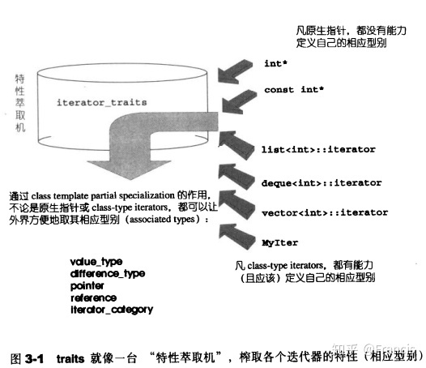

# Traits编程技法获取迭代器取值类型

迭代器在容器和泛型算法中是很关键的，STL目标是将容器数据与算法分隔开

**问题：如何在泛型编程中，推导出迭代器的取值类型，并且返回该取值，同时还要兼容基本类型**

迭代器本质类型是智能指针，但是如果是泛型算法那必然要容纳基本类型，就存在两种类型的指针，一种是STL迭代器的智能指针，另一种基本类型的原生指针也需要兼容，这是关键需要注意的地方

下面分别探究4中解决方案，逐渐越来越好

### 1.利用函数**template 参数推导取值类型**

```cpp
template <class I, class T>
void func_impl(I iter, T t) {
        T tmp; // 这里就是迭代器所指物的类别
        // ... 功能实现
}

int main() {
    int i;
    func(&i);
}
```

**（限制：只能推导参数类型，不能推导返回的类型）**

### 2.自定义Myiter内嵌类别声明value\_type

注意: c++不能对类型取值作为返回类型，下面的做法是错误的

```cpp
template <class I, class T>
T func_impl(I iter, T t) {
        T tmp; // 这里就是迭代器所指物的类别
        // ... 功能实现
}
template <class T>
(*T) func(T t) { // !!!Wrong code
    return func_impl(t, *t); // forward the task to func_impl
}
```

实现：

```cpp
template <class T>
struct MyIter {
    typedef T value_type; // 内嵌型别声明
    T* ptr;
    MyIter(T* p = 0) : ptr(p) {}
    T& operator*() const { return *ptr; }
};

template <class I>
typename I::value_type
func(I ite) {
    std::cout << "class version" << std::endl;
    return *ite;
}
int main() {
    // ...
    MyIter<int> ite(new int(8));
    cout << func(ite);    // 输出8
}
```

缺点：如果是一个泛型算法，那么它也绝对要接受一个原生指针作为迭代器，但是显然，你无法让下面的代码编译通过：

```cpp
int *p = new int(5);
cout<<func(p)<<endl; // error
```

### 3.函数偏特化的一种实现

解决上面的不足

```cpp
template <class T>
struct MyIter {
    typedef T value_type;
    T* ptr;
    MyIter(T* p = 0) : ptr(p) {}
    T& operator*() const { return *ptr; }
};

template <class I>
typename I::value_type
func(I ite) {
    //class version
    return *ite;
}
template <class I>
I func(I* ite) {
    //pointer version
    return *ite;
}
template <class I>
I func(const I* ite) {
    //const pointer version
    return *ite;
}
int main() {
    // ...
    MyIter<int> ite(new int(8));
    cout << func(ite)<<endl;
    int *p = new int(52);
    cout<<func(p)<<endl;
    const int k = 3;
    cout<<func(&k)<<endl;
}
```

**缺点：**函数偏特化，就是搞了太多重载函数来识别各种模式，但是这种问题就是会导致增加很多代码量，理论上需要给const指针 + 原生指针 + 迭代器指针 分别写函数，假如 func 有 100 万行行代码，那么就会造成极大的视觉污染。

### 4.STL中的traits来实现

 利用一个中间层`iterator_traits`固定了`func`的形式，使得重复的代码大量减少

把偏特化代码移到 `iterator_traits`上，只用使其支持 pointer 和 const pointer:\)



```cpp
template <class T>
struct MyIter {
    typedef T value_type; // 内嵌型别声明
    T* ptr;
    MyIter(T* p = 0) : ptr(p) {}
    T& operator*() const { return *ptr; }
};
// class type
template <class T>
struct iterator_traits {
    typedef typename T::value_type value_type;
};
// 偏特化1
template <class T>
struct iterator_traits<T*> {
    typedef T value_type;
};
// 偏特化2
template <class T>
struct iterator_traits<const T*> {
    typedef T value_type;
};

template <class I>
typename iterator_traits<I>::value_type
// 首先询问iterator_traits<I>::value_type,如果传递的I为指针,则进入特化版本
// iterator_traits直接回答;如果传递进来的I为class type,就去询问T::value_type.
func(I ite) {
    std::cout << "normal version" << std::endl;
    return *ite;
}
int main() {
    // ...
    MyIter<int> ite(new int(8));
    std::cout << func(ite)<<std::endl;
    int *p = new int(52);
    std::cout<<func(p)<<std::endl;
    const int k = 3;
    std::cout<<func(&k)<<std::endl;
}
```

**总结：**通过定义内嵌类型，我们获得了知晓 iterator 所指元素类型的方法，通过 traits 技法，我们将函数模板对于原生指针和自定义 iterator 的定义都统一起来，我们使用 traits 技法主要是为了解决原生指针和自定义 iterator 之间的不同所造成的代码冗余，这就是 traits 技法的妙处所在。

链接：[https://zhuanlan.zhihu.com/p/85809752](https://zhuanlan.zhihu.com/p/85809752) 

