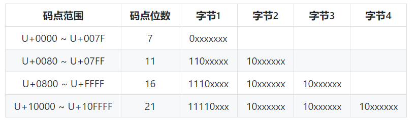

# ASCII, Unicode, UTF-8编码

### ASCII

ASCII是一种字符编码，把 128 个字符映射至整数 0 ~ 127

占字节大小：**1字节**

### Unicode

Unicode统一字符集 

包含了各种语言系统的文字 例如 劲 → U+52B2、峰 → U+5CF0 

**C 标准库没有关于 Unicode 的处理功能（C++11 有）** 

码点范围：U+0000 至 U+FFFF （固定编码长度）

占字节大小：**无论中英文都是2字节**

### UTF

UTF：Unicode 转换格式（Uniform Transformation Format） 

现时流行的 UTF 为 UTF-8、UTF-16 和 UTF-32 , UTF-8 的编码单元是 8 位的字节、UTF-16 为 16 位 

每种 UTF 会把一个码点储存为**一至多个编码单元（code unit）** ,所以是变长

**中文一般的UTF-8占3字节，ASCII的字符在UTF-8中都还是占1字节**

**Unicode转换UTF-8：** 



示例：

```c
strlen("天青色等烟雨，而我在等你!") //输出:37
```

